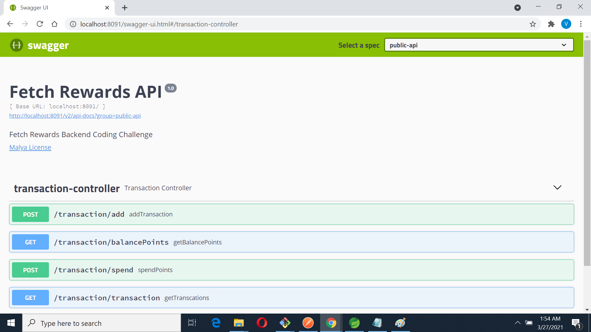

# Fetch-Rewards

# Requirements
* Java 8+
* Framework : Spring Boot

# Install Requirements
```
bash
maven
```

# Run the app
```
 mvn install / mvn clean install
 mvn spring-boot:run
 java -jar target/Fetch-Rewards-Assignment-0.0.1-SNAPSHOT.jar
```

# Access the app

swagger.json: http://localhost:8091/v2/api-docs?group=public-api

swagger-ui: http://localhost:8091/swagger-ui.html

swagger-ui looks like this:


# REST API document

## Add transaction points to  user account

### URL : http://localhost:8091/transaction/add


### POST Request

{ "payer": "DANNON", "points": 1000, "timestamp": "2020-11-02T17:00:00Z" }

### Response

Points added Successfully

    Status: 200 OK
    Content-Type: application/json
    
{
    "status": 403,
    "message": "Invalid Transaction"
}
 
    Status: 403 Forbidden
    Content-Type: application/json

## Spend points from the user account

### URL : http://localhost:8091/userAccount/spend

### DELETE Request
{
    "points" : 5000
}

### Response

[
    {
        "payer": "UNILEVER",
        "points": -200
    },
    {
        "payer": "MILLER COORS",
        "points": -4700
    },
    {
        "payer": "DANNON",
        "points": -100
    }
]


    Status: 200 OK
    Content-Type: application/json

-----------------------------------------------------------

{
    "status": 403,
    "message": "Insufficient funds"
}

    Status: 403 Forbidden
    Content-Type: application/json
 
## Get the balance points from the user account

### URL : http://localhost:8091/transaction/balancePoints 

### GET Request 
   
### Response

{
   "UNILEVER": 0,
   "MILLER COORS": 5300,
   "DANNON": 1000
}
    
    Status: 200 OK
    Content-Type: application/json
